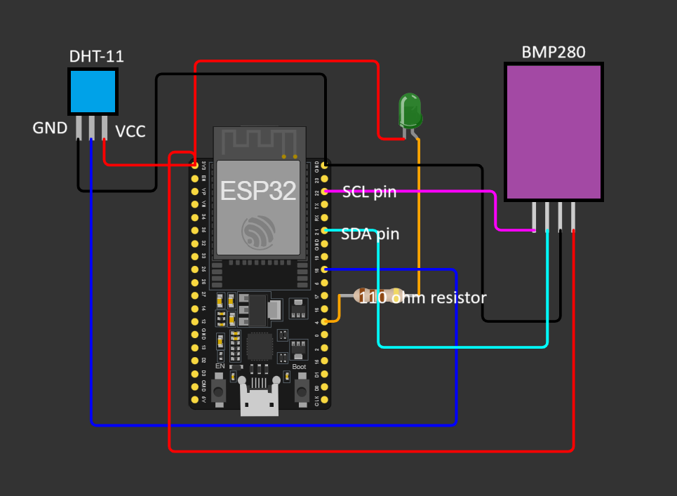
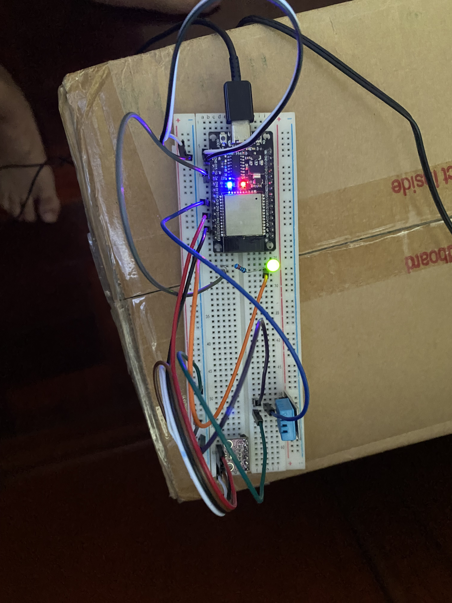
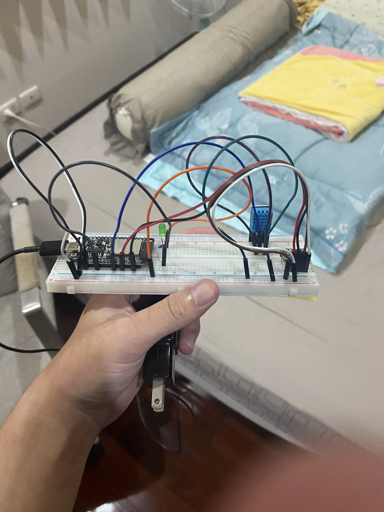

## NodeMCU setup guideline
1. Create a config.py consists of WIFI_SSID, WIFI_PASS, MQTT_BROKER, MQTT_USER and MQTT_PASS
2. Save config.py in your NodeMCU
3. Save [bmp280.py](nodemcu/bmp280.py) in your NodeMCU
4. Wire up the same as schematic below (You may use breadboard for joining wires)
5. Save [bmp_dht.py](nodemcu/bmp_dht.py) as main.py in your NodeMCU.

## Schematic

DHT-11 model may be different so the pin legs may be different from this picture. Please check the VCC, GND and signal pin to wire up correctly.

## Example of wiring

The LED on board should be on and green LED also should be on after giving it power. Also check the MQTT publishing message after you deploy your NodeMCU.

